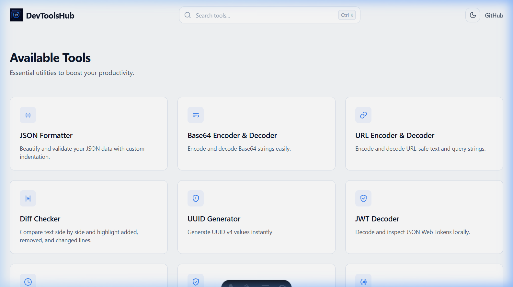
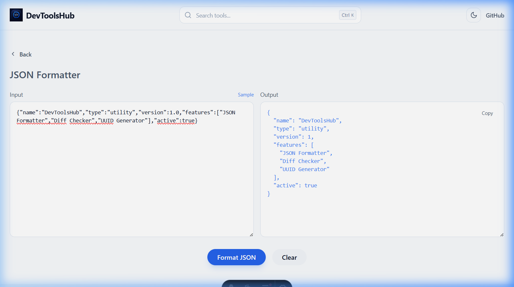
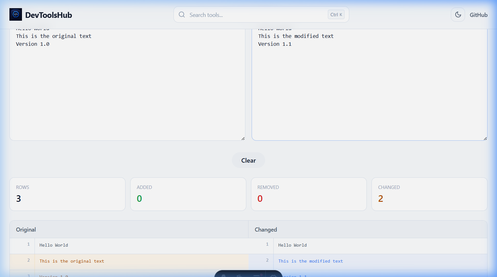
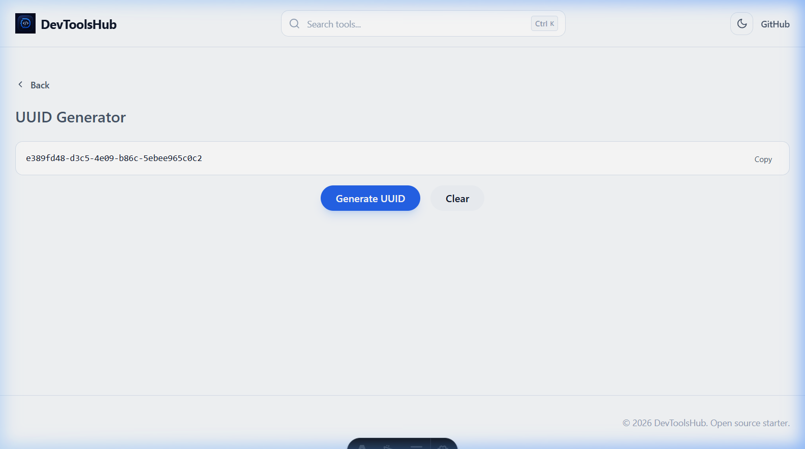

# 🛠️ DevToolsHub

Welcome to **DevToolsHub**! This is a collection of fast, secure, and easy-to-use tools for developers. Built with **Astro**, **React**, and **Tailwind CSS**.

Our goal is to make common developer tasks simpler while keeping your data safe. Everything runs directly in your browser. **Your data never leaves your computer.**


*DevToolsHub Home - A fast, local developer toolbox with a gorgeous dark mode interface.*

---

## ✨ Features

- **JSON Formatter**: Prettify and validate JSON with ease.
- **JWT Decoder**: Decode and inspect JSON Web Tokens locally.
- **Base64 Converter**: Encode and decode text to Base64 format.
- **URL Converter**: Safely encode or decode URL components.
- **Diff Checker**: Compare text, code, JSON, or config side by side.
- **Timestamp Converter**: Convert between Unix timestamps and readable dates.
- **UUID Generator**: Create secure, random UUIDs (v4).
- **Beautiful Dark Mode**: A sleek design that is easy on the eyes.

---

## 📸 App Screenshots

Here is a look at some of the most popular tools available in DevToolsHub:

### 📝 JSON Formatter

*Format, validate, and beautify raw JSON instantly with syntax highlighting.*

### 🔍 Diff Checker

*Compare text, code, or JSON side-by-side with clear visual indicators for differences.*

### 🆔 UUID Generator

*Generate cryptographically secure v4 UUIDs in bulk with one click.*

---

## 🔒 Privacy & Security

Most online tools send your data to a server for processing. DevToolsHub works differently:
- **Local Only**: All processing happens entirely in your browser using JavaScript.
- **No Tracking**: We do not track your inputs or your usage.
- **Open Source**: The code is public so you can see exactly how your data is handled.

---

## 📂 Project Structure

```text
src/
  ├── components/tool/  shared tool wrappers (e.g. ToolTextarea, ToolActions)
  ├── features/         core logic for each tool (one folder per tool)
  ├── ui/               reusable basic components (Button, CopyButton, etc.)
  ├── layouts/          page templates
  ├── pages/            the main routes and tool pages
  └── styles/           global styles and custom scrollbars
```

---

## 🚀 Getting Started

To run the project on your own machine:

1. **Install dependencies**:
   ```bash
   pnpm install
   ```

2. **Run the project**:
   ```bash
   pnpm dev
   ```

---

## ➕ Adding a New Tool

We love new tools! If you want to add one, here is the simplest way:

1. **Create the Feature**: Add a folder in `src/features/` with your React code.
2. **Use Shared UI**: Use components from `src/ui/` and `src/components/tool/` to keep things looking consistent.
3. **Create the Page**: Add a new `.astro` file in `src/pages/tools/` to host your feature.
4. **Link it**: Add your new tool to the list in `src/pages/index.astro`.

---

## 🤝 Contributing

We welcome contributions of all kinds! Whether it's a bug fix, a new tool, or improving documentation, we would love to have your help. 

* **Good First Issues**: Documentation tasks, screenshot updates, and minor text/styling fixes are perfect first issues for new contributors.
* **Get Started**: Please see [CONTRIBUTING.md](./CONTRIBUTING.md) to get started with setting up the project and opening a pull request.

---

## 📄 License

This project is open-source and available under the [MIT License](./LICENSE).
